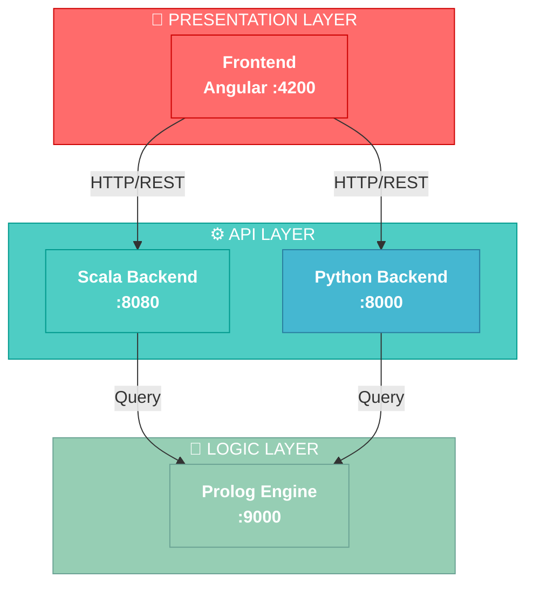

<div align="center">

# 🚀 ITERA - Plataforma de Microservicios

[](/)
[](/)
[](./LICENSE)

> Plataforma modular basada en arquitectura de microservicios con múltiples tecnologías integradas

[🌐 Inicio Rápido](#-inicio-rápido) • [📚 Documentación](#-documentación) • [🛠️ Stack](#-stack-tecnológico) • [🤝 Contribuir](#-contribución)

</div>

---

## 🏗️ Arquitectura



## 📦 Servicios

| Servicio | Tecnología | Puerto | Status | Descripción |
|:--------:|:----------:|:------:|:------:|:-----------|
| **itera-angular** |  | `4200` | ✅ | Frontend SPA responsive |
| **Itera** |  | `8080` | ✅ | API REST principal |
| **Itera-python** |  | `8000` | ✅ | Servicios auxiliares |
| **itera-prolog** |  | `9000` | ✅ | Motor de lógica |

## 🚀 Inicio Rápido

### 🐳 Con Docker Compose (Recomendado)

```bash
# Clonar y entrar al directorio
git clone <repo>
cd itera-workspace

# Levantar todos los servicios
docker-compose up -d

# Ver logs en tiempo real
docker-compose logs -f

# Detener todo
docker-compose down
```

**Acceso inmediato:**
- Frontend: http://localhost:4200
- API Scala: http://localhost:8080
- API Python: http://localhost:8000
- Prolog: http://localhost:9000

---

### 💻 Desarrollo Local (Sin Docker)

#### 1️⃣ Frontend (Angular)
```bash
cd itera-angular
npm install
npm start
# → http://localhost:4200
```

#### 2️⃣ Backend Scala
```bash
cd Itera
sbt run
# → http://localhost:8080
```

#### 3️⃣ Backend Python
```bash
cd Itera-python
python -m venv venv

# Windows
venv\Scripts\activate

# Linux/Mac
source venv/bin/activate

pip install -r requirements.txt
python main.py
# → http://localhost:8000
```

#### 4️⃣ Prolog
```bash
cd itera-prolog
# Consultar documentación específica
```

## 📚 Documentación

```
📖 Documentación de Servicios
├── 🎨 itera-angular      → [README](./itera-angular/README.md)
├── ⚙️  Itera (Scala)      → [README](./Itera/README.md)
├── 🐍 Itera-python       → [README](./Itera-python/README.md)
└── 🧠 itera-prolog       → [README](./itera-prolog/README.md)
```

Cada servicio tiene documentación específica con:
- Instalación y configuración
- Scripts y comandos
- Estructura del proyecto
- API endpoints
- Contribución

## 🔗 URLs - Acceso Rápido

| Servicio | URL | Descripción |
|:--------:|:---:|:-----------|
| 🎨 **Frontend** | http://localhost:4200 | Aplicación Angular |
| ⚙️ **API Scala** | http://localhost:8080 | REST API principal |
| 🐍 **API Python** | http://localhost:8000 | Servicios auxiliares |
| 🧠 **Prolog** | http://localhost:9000 | Motor de lógica |

---

## 🛠️ Stack Tecnológico

<table>
<tr>
<td width="25%">

### 🎨 Frontend
- Angular 17+
- TypeScript
- CSS3/Tailwind
- RxJS

</td>
<td width="25%">

### ⚙️ Backend 1
- Scala
- Play Framework
- REST API
- SBT

</td>
<td width="25%">

### 🐍 Backend 2
- Python 3.9+
- FastAPI
- REST API
- pip

</td>
<td width="25%">

### 🧠 Logic
- SWI-Prolog
- Lógica declarativa
- Rules Engine
- Inference

</td>
</tr>
</table>

### 🚀 DevOps & Tools
- **Contenedorización**: Docker & Docker Compose
- **Versionado**: Git
- **Orquestación**: Docker Compose
- **Monitoreo**: Health Checks integrados

---

## ✅ Requisitos Previos

| Requisito | Versión | Descargar |
|:----------|:-------:|:-------:|
| Docker | 20.10+ | [docker.com](https://www.docker.com) |
| Docker Compose | 2.0+ | Incluido en Docker Desktop |
| Node.js | 18+ | [nodejs.org](https://nodejs.org) |
| Scala/JDK | 11+ | [scala-lang.org](https://www.scala-lang.org) |
| Python | 3.9+ | [python.org](https://www.python.org) |
| SWI-Prolog | 8.0+ | [swi-prolog.org](https://www.swi-prolog.org) |

> ℹ️ **Nota**: Si usas Docker Compose, solo necesitas tener Docker instalado

## 🔄 Flujo de Desarrollo

```
┌─────────────────────────────────────────────────────────┐
│  1️⃣  Crear rama feature desde develop                  │
│         git checkout -b feature/nueva-funcionalidad     │
└─────────────────────────────────────────────────────────┘
                          ↓
┌─────────────────────────────────────────────────────────┐
│  2️⃣  Implementar cambios en servicios                  │
│         Editar código + tests locales                   │
└─────────────────────────────────────────────────────────┘
                          ↓
┌─────────────────────────────────────────────────────────┐
│  3️⃣  Ejecutar tests                                    │
│         npm test / sbt test / pytest                    │
└─────────────────────────────────────────────────────────┘
                          ↓
┌─────────────────────────────────────────────────────────┐
│  4️⃣  Crear Pull Request                                │
│         Describir cambios y obtener aprobación          │
└─────────────────────────────────────────────────────────┘
                          ↓
┌─────────────────────────────────────────────────────────┐
│  5️⃣  Merge a develop                                   │
│         Esperar aprobación de code review               │
└─────────────────────────────────────────────────────────┘
                          ↓
┌─────────────────────────────────────────────────────────┐
│  6️⃣  Deploy a staging/producción                       │
│         Desde develop → main (automático o manual)      │
└─────────────────────────────────────────────────────────┘
```

---

## 🐛 Troubleshooting

### ❌ Los servicios no se conectan

```bash
# Verificar que Docker Compose está corriendo
docker-compose ps

# Ver logs de errores
docker-compose logs backend-scala
docker-compose logs backend-python

# Reiniciar servicios
docker-compose restart

# Limpiar y empezar de nuevo
docker-compose down
docker-compose up -d --build
```

### ❌ Puerto ya está en uso

```bash
# Cambiar puertos en docker-compose.yml
# O liberar el puerto:
# Windows
netstat -ano | findstr :4200
taskkill /PID <PID> /F

# Linux/Mac
lsof -i :4200
kill -9 <PID>
```

### ❌ Frontend no encuentra la API

1. Verificar archivo `itera-angular/src/app/app.config.ts`
2. Comprobar URLs base correctas
3. Revisar CORS en backends
4. Reiniciar frontend

### ❌ Build de Docker falla

```bash
# Limpiar caché de Docker
docker-compose down -v
docker system prune -a

# Rebuild con logs
docker-compose up -d --build
docker-compose logs -f
```

### ❌ Base de datos/Estado corrupto

```bash
# Resetear todo
docker-compose down -v     # Elimina volúmenes
docker-compose up -d       # Levanta limpio
```

## 📞 Contribución & Contacto

### 🤝 Cómo Contribuir

1. **Fork** el repositorio
2. **Crea una rama** para tu feature: `git checkout -b feature/AmazingFeature`
3. **Commit** tus cambios: `git commit -m 'Add some AmazingFeature'`
4. **Push** a la rama: `git push origin feature/AmazingFeature`
5. **Abre un Pull Request** describiendo tus cambios

### 📋 Código de Conducta

Asegúrate de:
- ✅ Pasar todos los tests
- ✅ Mantener la consistencia de código
- ✅ Documentar cambios significativos
- ✅ Seguir el estilo de código del proyecto

### 💬 Reportar Bugs

Abre un **Issue** con:
- Descripción clara del problema
- Pasos para reproducir
- Comportamiento esperado
- Comportamiento actual
- Ambiente (SO, versiones, etc.)

---

## 📄 Licencia

Este proyecto está bajo la licencia **MIT** - mira el archivo [LICENSE](./LICENSE) para más detalles.

---

## 🙌 Agradecimientos

Gracias a todos los contribuyentes y a la comunidad de código abierto.

---

<div align="center">

### ⭐ Si te gusta, dale una estrella!

**Última actualización**: Mayo 2026

[↑ Volver al inicio](#-itera---plataforma-de-microservicios)

</div>
